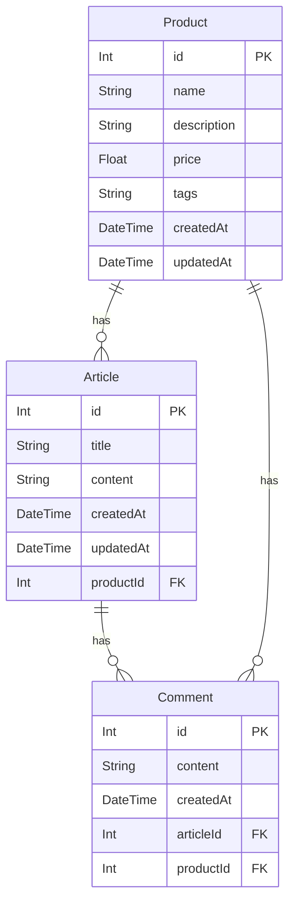

# Database Model

```mermaid
erDiagram
  Product {
    Int id PK
    String name
    String description
    Float price
    String tags
    DateTime createdAt
    DateTime updatedAt
  }
  Article {
    Int id PK
    String title
    String content
    DateTime createdAt
    DateTime updatedAt
    Int productId FK
  }
  Comment {
    Int id PK
    String content
    DateTime createdAt
    Int articleId FK
    Int productId FK
  }

  Product ||--o{ Article : has
  Article ||--o{ Comment : has
  Product ||--o{ Comment : has
```