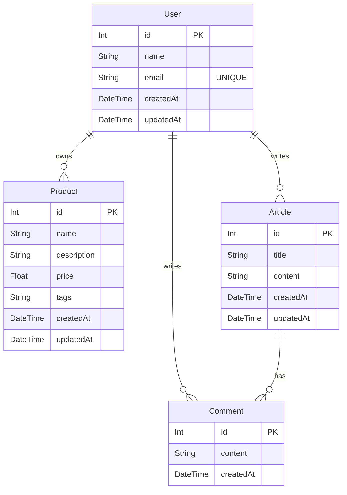

# Database Model

```mermaid
erDiagram
  User {
    Int id PK
    String name
    String email "UNIQUE"
    DateTime createdAt
    DateTime updatedAt
  }
  Product {
    Int id PK
    String name
    String description
    Float price
    String tags
    DateTime createdAt
    DateTime updatedAt
  }
  Article {
    Int id PK
    String title
    String content
    DateTime createdAt
    DateTime updatedAt
  }
  Comment {
    Int id PK
    String content
    DateTime createdAt
  }
  User ||--o{ Article : writes
  User ||--o{ Comment : writes
  User ||--o{ Product : owns
  Article ||--o{ Comment : has
```