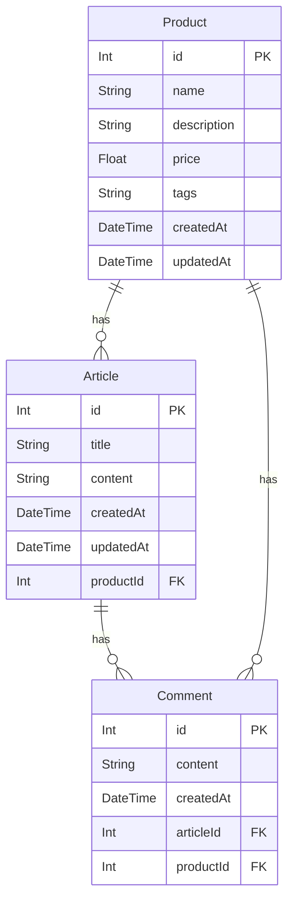

## 🌗 SPRINT MISSION 2 ( 25 / 05 / 28 수정 )
>**NB 2기 강시연**  

## 기술  
- **언어**: JavaScript  
- **라이브러리/프레임워크**: Node.js, Express, PostgreSQL, multer  

## 기능
### 중고마켓  
- **Product** 스키마 설계  
- 상품 등록 / 상세 조회 / 수정 / 삭제 API  
- 검색 기능(이름, 설명 포함 단어)  
- offset 방식 페이지네이션  
- 최신순 정렬  

### 자유게시판  
- **Article** 스키마 설계  
- 게시글 등록 / 상세 조회 / 수정 / 삭제 API  
- 검색 기능(제목, 내용 포함 단어)  
- offset 방식 페이지네이션  
- 최신순 정렬  

### 댓글  
- 중고마켓, 자유게시판 각각 댓글 등록 / 수정 / 삭제 / 조회 API  
- cursor 방식 페이지네이션 적용  

### 이미지 업로드  
- **multer 미들웨어**를 이용한 이미지 업로드 API  
- 서버에 저장 후 이미지 경로 응답  

### 공통 기능  
- **유효성 검증 미들웨어** 적용
- **에러 핸들러 미들웨어** 구현
- **라우트 중복 제거**(app.route, express.Router 사용)  
- **환경 변수 관리(.env) 및 CORS 설정** 
- 데이터베이스 관계 설정(onDelete 포함) 및 시딩 코드 작성  

# Database Model
