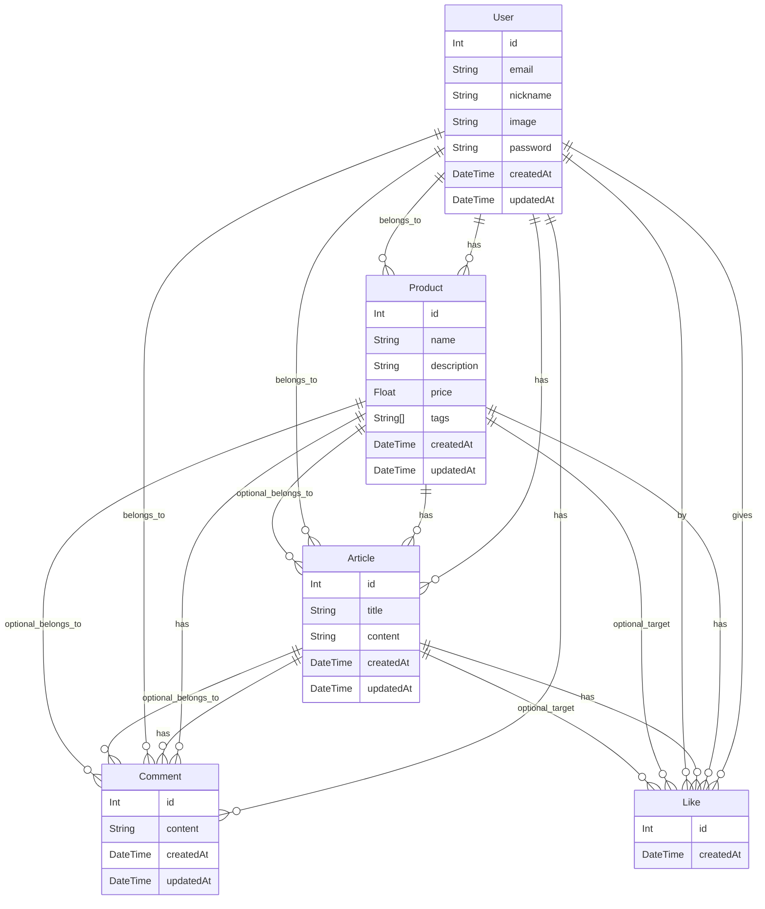

## 🌕 SPRINT MISSION 4 ( 25 / 07 / 11 수정 )  
> **NB 2기 강시연**  

## 기술  
- **언어**: TypeScript  
- **라이브러리/프레임워크**: Node.js, Express, PostgreSQL, Prisma  
- **개발환경**: `ts-node`, `nodemon`, `dotenv`, `tsconfig`, `@types/express`

## 🛠️ 타입스크립트 마이그레이션

- 기존 JS 기반 프로젝트를 **TypeScript 프로젝트**로 전체 마이그레이션  
- `any` 타입 최소화 및 인터페이스 / 타입 별칭 적극 사용  
- `tsconfig.json` 구성 (예: `outDir`, `strict`, `esModuleInterop` 등)  
- 전역 타입 선언 확장 (`declare global`로 `req.user` 확장)  
- DTO, 유틸리티 타입으로 코드의 타입 안정성 향상  

## 🧱 계층 분리 (Layered Architecture)

- `Controller`, `Service`, `Repository` 디렉토리로 분리  
- 각 계층의 역할에 따라 책임을 명확히 분리  
- 계층 간 데이터 전달 시 **DTO** 사용  
- 미들웨어, 에러 핸들링, 응답 포맷 통일

## 👥 인증 / 인가 기능

### 🔐 회원 기능  
- **User 스키마 설계**  
  - 필드: `id`, `email`, `nickname`, `image`, `password`, `createdAt`, `updatedAt`
- **회원가입 API**  
  - `email`, `nickname`, `password`를 입력받아 회원가입  
  - 비밀번호는 `bcrypt`로 해싱 후 저장
- **로그인 API**  
  - 로그인 성공 시 Access Token 및 Refresh Token 발급
- **토큰 재발급 API (심화)**  
  - Refresh Token을 통한 Access Token 재발급 기능 구현

### ✅ 인가 처리
- **상품 기능 인가**  
  - 로그인한 유저만 상품 등록 가능  
  - 상품 등록자만 수정 및 삭제 가능
- **게시글 기능 인가**  
  - 로그인한 유저만 게시글 등록 가능  
  - 게시글 작성자만 수정 및 삭제 가능
- **댓글 기능 인가**  
  - 로그인한 유저만 댓글 작성 가능  
  - 댓글 작성자만 댓글 수정 및 삭제 가능

### 🧑‍💼 유저 정보 기능  
- 내 정보 조회  
- 내 정보 수정  
- 비밀번호 변경  
- 내가 등록한 상품 목록 조회  
- 응답에서 비밀번호는 제외 처리

### 💖 좋아요 기능 (심화)  
- 상품 및 게시글에 ‘좋아요’ / ‘좋아요 취소’ 기능  
- 조회 시 해당 항목에 대한 `isLiked` 불린값 포함  
- 유저가 좋아요한 상품 목록 조회 가능

## 📦 데이터 모델 (ERD)

