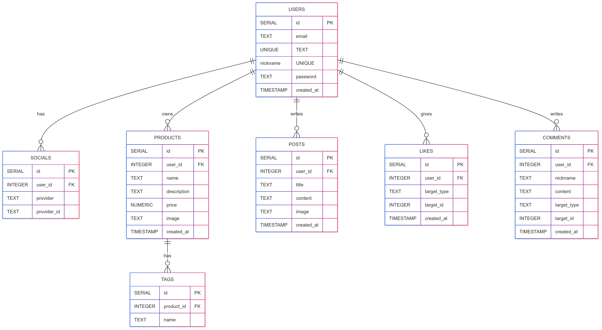

## 🌘 SPRINT MISSION 6 (2025 / 07 / 22 수정)  
> **NB 2기 강시연**

## 미션 개요

SQL 기본 문법을 연습하는 실습 과제로, 직접 스키마를 설계하고 ERD를 그린 뒤, 총 14개의 SQL 쿼리를 작성했습니다.


## 사용 환경

- **DBMS**: PostgreSQL  
- **도구**: psql, pgAdmin4, draw.io  
- **파일 구성**:  
  - `schema.sql`: 테이블 생성  
  - `erd.png`: ER 다이어그램 이미지  
  - `queries.sql`: SQL 쿼리 14개

## 테이블 구조 요약

| 테이블명       | 설명 |
|----------------|------|
| `users`        | 사용자 정보 |
| `socials`      | 간편 로그인 연동 정보 |
| `products`     | 상품 정보 |
| `tags`         | 상품 태그 |
| `posts`        | 게시글 |
| `likes`        | 상품/게시글 좋아요 (다형성) |
| `comments`     | 상품/게시글 댓글 (다형성) |

- `likes`, `comments`는 `target_type`, `target_id`를 통해 다형성 구조로 설계됨.

## ER 다이어그램




## SQL 쿼리 실습

총 14개의 SQL 쿼리를 작성했습니다.  
사용자 정보 수정, 상품 CRUD, 좋아요/댓글 기능, 키워드 검색, 커서 기반 페이지네이션까지 포함되어 있습니다.

> 전체 쿼리는 `queries.sql` 파일에 정리되어 있습니다.

```sql
-- 닉네임 수정
UPDATE users SET nickname = 'test' WHERE id = 1;

-- 내가 생성한 상품 조회 (3페이지, 10개씩)
SELECT * FROM products 
WHERE user_id = 1
ORDER BY created_at DESC
LIMIT 10 OFFSET 20;

-- 내가 생성한 상품 개수
SELECT COUNT(*) FROM products WHERE user_id = 1;

-- 좋아요 누른 상품 조회
SELECT p.*
FROM product_likes pl
JOIN products p ON pl.product_id = p.id
WHERE pl.user_id = 1
ORDER BY pl.created_at DESC
LIMIT 10 OFFSET 20;

-- 좋아요 누른 상품 개수
SELECT COUNT(*) FROM product_likes WHERE user_id = 1;

-- 상품 생성
INSERT INTO products (user_id, title, description, created_at, updated_at)
VALUES (1, '상품', '상품 설명', NOW(), NOW());

-- 상품 목록 조회 + 좋아요 수 포함
SELECT p.*, COUNT(pl.id) AS like_count
FROM products p
LEFT JOIN product_likes pl ON p.id = pl.product_id
WHERE p.title ILIKE '%test%'
GROUP BY p.id
ORDER BY p.created_at DESC
LIMIT 10 OFFSET 0;

-- 상품 상세 조회 (좋아요 수 포함)
SELECT p.*, COUNT(pl.id) AS like_count
FROM products p
LEFT JOIN product_likes pl ON p.id = pl.product_id
WHERE p.id = 1
GROUP BY p.id;

-- 상품 수정
UPDATE products
SET title = '수정된 제목', description = '수정된 설명', updated_at = NOW()
WHERE id = 1;

-- 상품 삭제
DELETE FROM products WHERE id = 1;

-- 좋아요 등록
INSERT INTO product_likes (user_id, product_id, created_at)
VALUES (1, 2, NOW());

-- 좋아요 취소
DELETE FROM product_likes
WHERE user_id = 1 AND product_id = 2;

-- 댓글 작성
INSERT INTO product_comments (user_id, product_id, content, created_at)
VALUES (1, 2, '댓글입니다.', NOW());

-- 댓글 커서 페이지네이션
SELECT *
FROM product_comments
WHERE product_id = 1
  AND (created_at < '2025-03-25'
       OR (created_at = '2025-03-25' AND id < 100))
ORDER BY created_at DESC, id DESC
LIMIT 10;
```